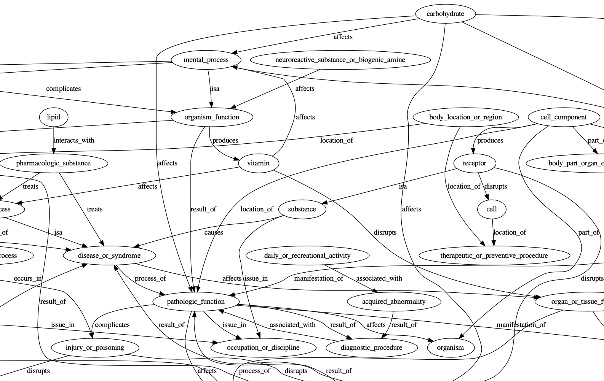

# Unified Medical Language System (UMLS) RDF Triple Data Graph Plot

## This example is NOT in my book yet, but is useful for using GraphViz in Hy programs.

The data file test.triples is a partial copy of a data file from the Salesforce Multi-Hop Deep Learning Graph Search project that you can find here:

[https://github.com/salesforce/MultiHopKG](https://github.com/salesforce/MultiHopKG)

Install dependencies:

    pip install graphviz

Run the example:

    hy UMLS_graph.hy

This creates the PDF file mhop.gv.pdf.

Generated plot (just part of the plot is shown):

